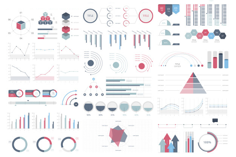

Portfolio
=========

Programming Projects
--------------------

*For access to my private project repositories, please [email me](mailto:example@csustudent.net?subject=GitHub%20Access) with the subject line, GitHub Access.

---
### [Right Triangle Maker | CSCI 301](project1)

---
### [Final Processor | CSCI 330](project1)

---
### [Blackjack Playing Program | CSCI 325](project1)

---
### [Cypher Encoder/Decoder | CSCI 452](project1)

---

Ethics Papers
-------------

### [The Ethics of Hacking](/pdf/Ethics_Paper_Procedural_Programming.pdf)

-   **Class:** Procedural Programming
-   **Grade:** A

### [Meme Ethics](/pdf/Ethics_Paper_Architecture.pdf)

-   **Class:** Computer Architecture
-   **Grade:** Unknown

### [Ethics of Copyright and Code](/pdf/Ethics_Paper_Scripting.pdf)

-   **Class:** Survey of Scripting Languages
-   **Grade:** A

---

Presentations
-------------

### [Presentation 1 Title](/pdf/sample_presentation.pdf)

- **Class:** 
- **Grade:**

### [Presentation 2 Title](/pdf/sample_presentation.pdf)

- **Class:** 
- **Grade:**

---

Page template forked from <a href="https://github.com/csu-cs/csci-portfolio">CSU-CS</a>

<!-- Remove above link if you don't want to attributive -->
