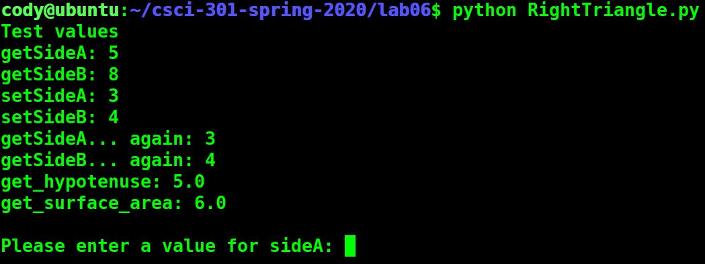

[Back to Portfolio](./)

Right Triangle Maker
===============

-   **Class:** CSCI 301: Survey of Scripting Languages
-   **Grade:** 100
-   **Language(s):** Python
-   **Source Code Repository:** [CodyJCain/RightTriangle](https://github.com/CodyJCain/Right-Triangle)  
    (Please [email me](mailto:cjcain1@csustudent.net?subject=GitHub%20Access) to request access.)

## Project description

This project is a program which can create a right triangle based on the dimensions of two sides.

## How to compile / run the program

Navigate to the directory which contains the program. Compile and run using the following command.

```bash
python RightTriangle.py
```

## Design

When the program first runs, it outputs a set of test values which are used to demonstrate that the functions are all working properly (see Fig 1). After this the user is prompted to input values for side A and B which are the two sides that connect at a right angle. The program then uses these values to compute the value side C which is the hypotenuse and the surface area of the triangle (see Fig 2).


Fig 1. Test values


Fig 2. User input and program output 

[Back to Portfolio](./)
