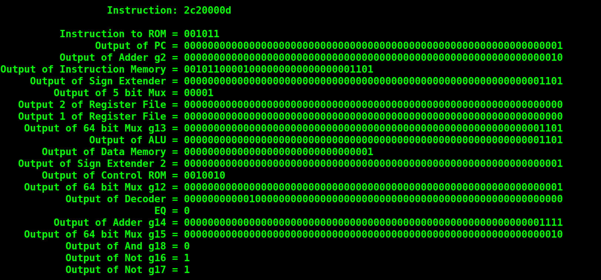

[Back to Portfolio](./)

Final Processor
===============

-   **Class:** CSCI 330 Computer Architecture
-   **Grade:** 100
-   **Language(s):** Verilog
-   **Source Code Repository:** [CodyJCain/Processor](https://github.com/CodyJCain/Processor)  
    (Please [email me](mailto:cjcain1@csustudent.net?subject=GitHub%20Access) to request access.)

## Project description

This is a virtual 64 bit single cycle processor written in Verilog. The processor is built out of many small components which are all compiled together into a single file. The processor runs on a version of assembly which can be written and assembled using the included assembler.

## How to compiles / run the program

To compile the program navigate to the folder containing the .v files and run the command 

```bash
iverilog *.v && ./a.out
```

## UI Design

When the program runs it automatically reads the assembly file which is included in the directory. The processor outputs the current instruction in hexadecimal as well as the binary values contained in each individual component as each instruction runs (see Fig 1). It also outputs the values of each register in memory to see how they change over the course of the program’s runtime (see Fig 2). This process repeats until there are no more instructions at which point the program ends.


Fig 1. Output of components


Fig 2. Output of memory registers

[Back to Portfolio](./)
