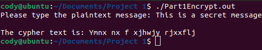
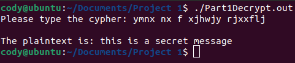
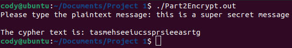
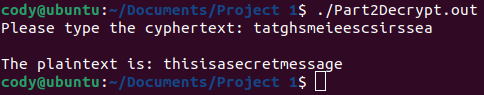
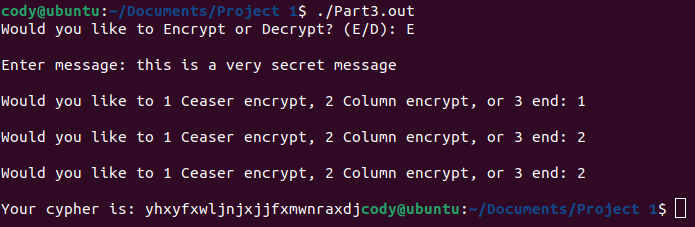
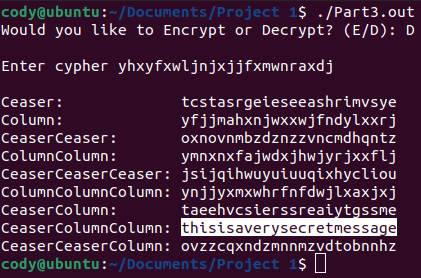

[Back to Portfolio](./)

Project 1 Title
===============

-   **Class:** CSCI 452: Network Penetration
-   **Grade:** 110
-   **Language(s):** C++
-   **Source Code Repository:** [features/mastering-markdown](https://guides.github.com/features/mastering-markdown/)  
    (Please [email me](mailto:cjcain1@csustudent.net?subject=GitHub%20Access) to request access.)

## Project description

This project is a set of five programs which facilitate the encryption and decryption of a Caesar Cypher and a Columnar Transposition cypher. They allow the user to input a message and outputs either an encoded cypher or a plaintext depending on the program used.

## How to compiles / run the program

To compile the program I used gpp on Linux. To run the program run the compiled executables.
```bash
cd ./project
gpp -o name.out program_name.cpp
```

## Design

Part 1 of this project is to encrypt and decrypt a Caesar Cypher which is a form of substitution cypher where one letter is replaced with another. This program uses a shift-substitution cypher where each letter is replaced by the letter five to the right. In Part1Encrypt the user inputs a message and the program outputs the encrypted cypher text (see Fig 1). In Part1Decrypt the opposite occurs and the user inputs the cypher and the program outputs the plain text (see Fig 2). Part 2 is a set of two programs for encrypting and decrypting a columnar transposition cypher. This cypher is where a message is written out in rows of a certain number of letters and then read out vertically through the columns. This program uses a character per row count of 6. Part2Encrypt allows a user to input a message and thew program outputs the cypher (see Fig 3). Part2Decrypt has a user input the encrypted message and outputs the plaintext (see Fig 4). Part 3 puts the other two parts together into a single program. It has two modes. The first mode is the encryption mode. In this mode the user is first asked to input their message they wish to encrypt. Next the user enters a number for the type of encryption they want to use for up to three iterations. After the encryption is finished the program outputs the cypher (see Fig 5). The second mode is the decrypt mode. Because there are a very limited number of possible encryption possibilities the program simply brute forces all of them. The user inputs the cypher and the program outputs all of the possible encryption methods (see Fig 6). It is then up to the user to determine which output is English.


Fig 1. Part 1 Encrypt


Fig 2. Part 1 Decrypt


Fig 3. Part 2 Encrypt


Fig 4. Part 2 Decrypt


Fig 5. Part 3 Encrypt Mode


Fig 6. Part 3 Decrypt Mode

[Back to Portfolio](./)
